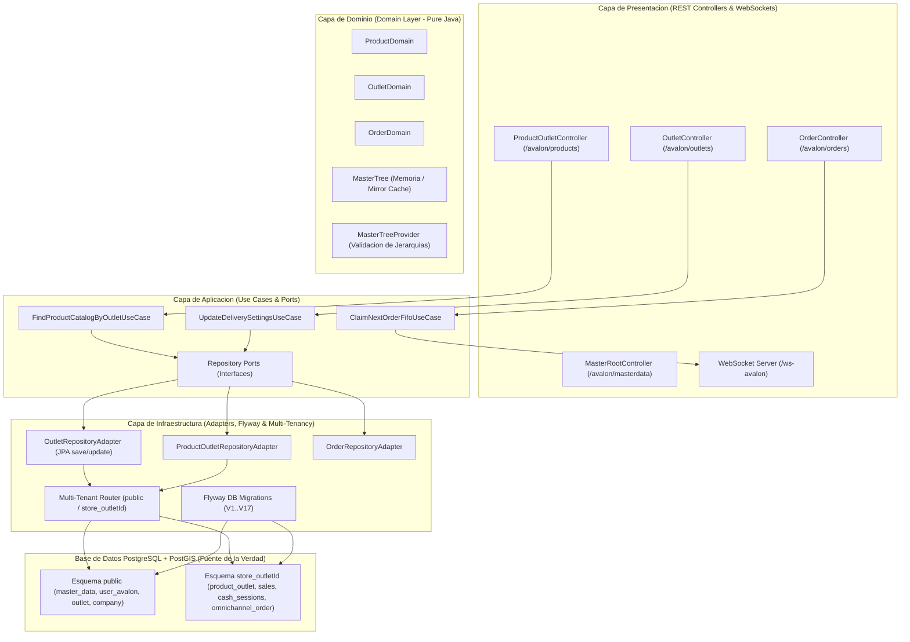

# Reglas Globales de Respuesta y Memoria de Arquitectura (ApiAvalon)

## Politica de Idioma Obligatoria
El espanol es el unico idioma permitido para todas las explicaciones y descripciones arquitectonicas. Esta regla tiene la maxima prioridad y siempre debe cumplirse.

## Reglas de Idioma y Codificacion de Caracteres
- Responde siempre en espanol de Latinoamerica.
- Se breve en las explicaciones.
- **Regla ASCII (Sin Tildes ni N):** Para prevenir problemas de codificacion y fallos en Maven/JVM entre Windows, Linux y Docker, todos los archivos del proyecto (`application.properties`, `.env`, fuentes Java, scripts SQL, comentarios y markdown) se escribiran con **caracteres ASCII planos (sin tildes y reemplazando 'n' por 'n')** (ej. `expiracion`, `configuracion`, `ano`, `diseno`).
- **Labels de UI:** Las tildes o 'n' solo se usaran en etiquetas visibles de UI (usando escapes `\uXXXX` cuando sea necesario).

## Integracion con IDEs (JetBrains Companion)
- **Uso Obligatorio de MCP JetBrains Companion:** Se deben utilizar las herramientas `jetbrains-companion` (`ide_get_active_editor`, `ide_get_open_files`, `ide_get_diagnostics`, `ide_open_file`) para interactuar con los entornos de desarrollo abiertos por el usuario: **IntelliJ IDEA** (para la API Spring Boot `ApiAvalon`) y **Android Studio** (para la aplicacion movil `AvalonMovilApp`).

## Reglas de Control de Versiones con Git (Commit Convention y Flujo de Ramas)
- Todo desarrollo de caracteristicas o refactorizacion debe realizarse **primero en la rama `AV_CORE_2`**. Nunca en `master` directamente.
- Todo commit debe seguir la nomenclatura: `COMMIT VERSION X.Y.Z <tipo>(<modulo>): <descripcion>`
- Consultar previamente `git log -n 5` para incrementar la version correlativa (`COMMIT VERSION 0.0.X`).
- Los commits deben ser atomicos, pequenos y frecuentes sobre codigo que compila correctamente. Sin megacommits.
- **Regla Estricta de Aprobacion Previa:** NUNCA ejecutar `git commit` de forma automatica. Primero verificar la compilacion y ejecucion exitosa de la solucion, presentar los resultados al usuario y esperar su APROBACION EXPLICITA para proceder con el commit.

## Archivo de Referencia Obligatorio (masterData.txt)
- `masterData.txt`: Documento de referencia permanente en la raiz con la jerarquia del arbol de datos maestros (`parent_id`, categorias, tipos de documento, estados, unidades). NUNCA debe ser eliminado ni ignorado.

## Reglas del Modelo de Catalogos de 3 Niveles (B2B Multi-Tenant)
- **Nivel 1 (Global Avalon - public.product):** Catalogo maestro de productos globales preestablecidos.
- **Nivel 2 (Catalogo Empresa - public.product_company):** Catalogo corporativo habilitado por el Gerente de Empresa (`GERGEN`).
- **Nivel 3 (Tienda Outlet - product_outlet):** Hereda automaticamente los productos de Nivel 2 para todas las tiendas de la compania (`company_id`).
- **Sugerencias de Tienda y Propagacion:** Las solicitudes creadas por tiendas (`product_suggestion_request`) en estado `PENDING` son aprobadas por el `GERGEN` mediante `/avalon/products/suggestions/{id}/approve`, promoviendolas a Nivel 2 e iniciando la propagacion automatica en cascada a Nivel 3 para todas las tiendas de esa empresa.

## Reglas del Modelo de Accesos y Permisos de 3 Niveles (RBAC Multi-Tenant)
- **Nivel 1 (SuperAdmin Global - ADMINTI, ADMINSYS):** Acceso global sin restriccion de esquema a public y a cualquier esquema company_*.
- **Nivel 2 (Gerencia de Empresa - GERGEN):** Acceso limitado al ambito de su `company_id`. Autoridad para aprobar sugerencias de productos (`/avalon/products/suggestions/{id}/approve`), configurar umbrales corporativos y listar el consolidado multi-sede.
- **Nivel 3 (Operativo de Tienda - ADMOULT, GERENTE, CJTURNO, VENDEDOR):** Acceso encapsulado por `TenantContext` al esquema de su tienda (`company_{id}` / `outlet_{id}`). Operaciones: ejecucion de ventas POS, sesiones de caja, arqueos a ciegas en 3 pasos y creacion de sugerencias de producto (`PENDING`).

## Arquitectura de Base de Datos Multi-Tenancy (Esquemas PostgreSQL)
- **Persistencia Multi-Esquema PostgreSQL:** La base de datos `AvalonApi` implementa Multi-Tenancy por esquema independiente para cada tienda (`store_{outletId}`) mas el esquema global `public`.
- **Esquema `public`:** Almacena datos globales compartidos: `user_avalon`, `person`, `role_assignment`, `outlet`, `company`, `master_data`, `credit_account`, `product`, `product_company`.
- **Esquemas de Tienda (`store_{outletId}`):** Almacenan transacciones locales aisladas: `cash_sessions`, `sales`, `sale_items`, `product_outlet`, `product_returns`, `omnichannel_order`.
- **Flyway Migrations:** Todo cambio en la base de datos se realiza **estrictamente mediante scripts versionados de Flyway** (`classpath:db/migration/V<N>__<descripcion>.sql`). `spring.jpa.hibernate.ddl-auto` se mantiene en `validate` o `none`.

## Modulos de Dominio Implementados en ApiAvalon
La API Spring Boot cuenta con 13 modulos de dominio activos organizados en arquitectura limpia:

1. **`user` / `person` / `role`:**
   - Autenticacion JWT con access token de corta duracion y refresh token seguro con rotacion y revocacion.
   - Asignacion de personas a usuarios y asignacion de roles RBAC de 3 niveles (`ADMINTI`, `GERGEN`, `ADMOULT`, `CJTURNO`, `VENDEDOR`, `CLIENTE`).

2. **`masterdata`:**
   - Jerarquia completa de datos maestros.
   - `MasterTreeProvider` mantiene un espejo cache en memoria cargado al iniciar la aplicacion (`@PostConstruct`) para validar en la capa de negocio jerarquias (`isChildOf`), existencia de nodos e invariantes sin generar queries SQL recursivas.

3. **`outlet`:**
   - Gestion de tiendas/puntos de venta.
   - Busqueda por radio geografico con indices espaciales **PostGIS** (`ST_DWithin`, `location::geography`).
   - Configuracion de servicio de delivery por tienda (`deliveryEnabled`, `deliveryFee`) con persistencia JPA via `update` en `OutletRepositoryAdapter`.

4. **`product`:**
   - Modelo de catalogos B2B en 3 Niveles (`product`, `product_company`, `product_outlet`).
   - Modulo de sugerencias desde tienda (`product_suggestion_request`) y aprobacion corporativa por el Gerente de Empresa (`GERGEN`).

5. **`order`:**
   - Gestion de pedidos omnicanal.
   - Reclutamiento de pedidos por cola **FIFO** por operador de tienda.
   - Despacho parcial item por item y finalizacion de pedidos.
   - Servidor WebSocket Nativo (`/ws-avalon`) para notificaciones y transmision en tiempo real de cambios de estado hacia la App y Dashboard TV.

6. **`cashregister`:**
   - Apertura de sesion de caja por turno.
   - Arqueo a ciegas en 3 pasos (conteo fisico sin revelacion del saldo teorico hasta el cierre).
   - Cortes y cierre de caja.

7. **`sale` / `inventory` / `unit`:**
   - Registro de ventas POS y calculo dinamico de stock y unidades apartadas por producto (`UnitConversionService`).
   - Fallback transparente de catalogo de tienda (`store_{outletId}.product_outlet`) hacia `public.product_outlet` para asegurar disponibilidad en el POS.

8. **`company` / `credit` / `claim` / `notification`:**
   - Registro corporativo de empresas Nivel 2.
   - Gestion de creditos directos y cuentas de saldo por usuario.
   - Sistema de reclamos (PQRS) y centro de notificaciones del sistema.

## Diagrama de Arquitectura de ApiAvalon



## Estructura del Proyecto

```
org.frias.avalon
├───core
│   ├───configuration   // Spring Config, WebSocket Config
│   ├───exeptions       // Manejador global de excepciones
│   ├───jwt             // Proveedor JwtTokenProvider, Interceptores
│   ├───tenant          // TenantContext (Routing multi-esquema por tienda)
│   └───validation      // Validadores de invariantes
├───domain              // Capa de Dominio dividida por modulos
│   ├───cashregister    // Sesiones de caja y arqueos ciegos
│   ├───claim           // Reclamos PQRS
│   ├───company         // Gestion B2B Nivel 2
│   ├───credit          // Creditos directos
│   ├───inventory       // Inventario y stock
│   ├───masterdata      // Jerarquia y MasterTreeProvider
│   ├───notification   // Notificaciones
│   ├───order           // Pedidos omnicanal y mesa de empaque FIFO
│   ├───outlet          // Tiendas, PostGIS y Delivery
│   ├───person          // Personas e identificaciones
│   ├───product         // Catalogos de 3 niveles y sugerencias
│   ├───sale            // Ventas POS y apartados dinamicos
│   └───user            // Usuarios, JWT y RBAC 3 niveles
└───infraestructure     // Flyway DB Migrations (classpath:db/migration/)
```

## Principios Arquitectonicos y Estandares
- **Clean Architecture & DDD:** Dominio Java puro sin dependencias de Spring, JPA o Lombok.
- **Java Records para DTOs:** DTOs inmutables en capas de aplicacion y presentacion.
- **MasterTree para Validaciones:** Espejo en memoria para evitar N+1 queries en arboles de categorias y estados. PostgreSQL es la Fuente de la Verdad.
- **Pruebas Test-First:** Pruebas unitarias e integracion sobre PostgreSQL real (Testcontainers) con rollback transaccional (`@Transactional`). H2 deshabilitado.